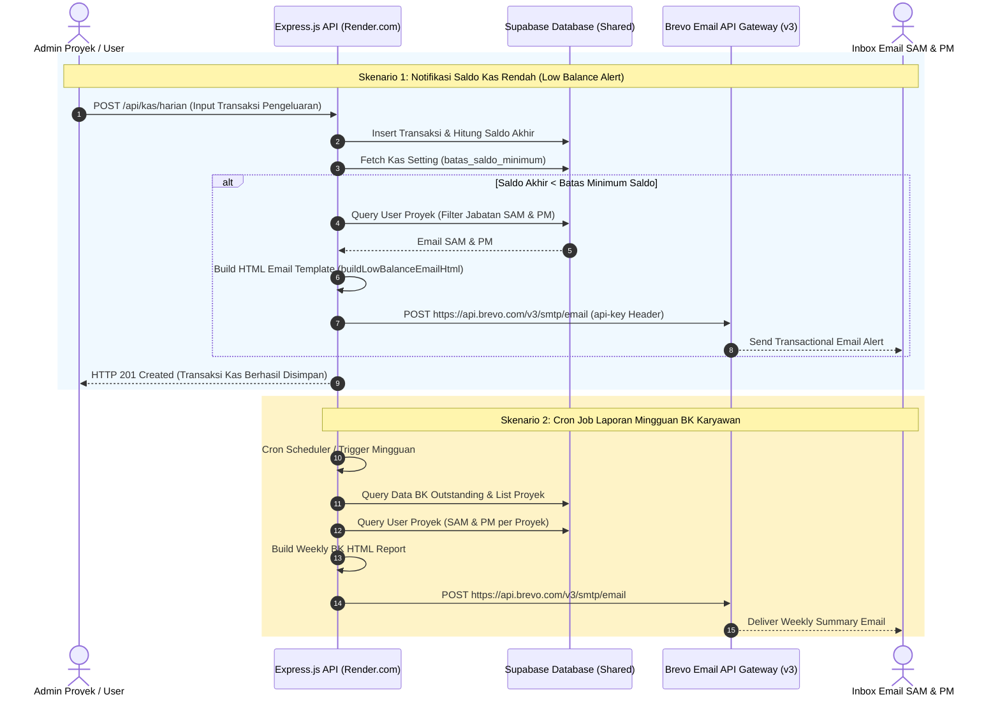

# 📧 Dokumentasi Arsitektur & Pengiriman Email Transaksional Brevo pada SIMONIKA

Dokumen ini menjelaskan secara komprehensif arsitektur teknis, alur pengiriman email, skenario pemicu (*trigger*), pembentukan template HTML, serta konfigurasi integrasi **Brevo (Sendinblue API v3)** pada aplikasi **SIMONIKA (Sistem Monitoring Kas Proyek — PT PP (Persero) Tbk)**.

---

## 📐 1. Gambaran Umum Architecture & Email Flow

SIMONIKA menggunakan **Brevo (Sendinblue REST API v3)** sebagai *Transactional Email Gateway* untuk mengirimkan notifikasi penting secara otomatis kepada pemangku kepentingan proyek, khususnya **Site Administration Manager (SAM)** dan **Project Manager (PM)**.



---

## 📁 2. Modul Utama & Kode Sumber (Source Code Architecture)

Seluruh logika pengiriman email transaksional diisolasi secara modular di dalam backend API (`apps/api/src/lib/`):

```
apps/api/src/lib/
├── brevo-mailer.ts        # 🌐 Client utama Brevo REST API v3 & Template Generator HTML
├── saldo-notifier.ts      # ⚠️ Evaluator saldo kas minimum & dispatcher notifikasi saldo
└── bk-weekly-report.ts    # 📊 Aggregator laporan mingguan BK Karyawan & email sender
```

### Penjelasan Peran File
1. **`brevo-mailer.ts`**:
   - Berfungsi sebagai wrapper HTTP `fetch` ke endpoint `https://api.brevo.com/v3/smtp/email`.
   - Menyediakan fungsi generic `sendEmail(params)` dengan header autentikasi `api-key`.
   - Mengandung fungsi pembentuk HTML Email terformat (*Email Design System*).
2. **`saldo-notifier.ts`**:
   - Memeriksa apakah transaksi kas keluar menyebabkan saldo kas berada di bawah parameter `batas_saldo_minimum` (Default: Rp 2.000.000).
   - Mengekstrak daftar email penerima yang menjabat sebagai **SAM** atau **PM** pada proyek terkait.
3. **`bk-weekly-report.ts`**:
   - Mengumpulkan data Bukti Kas (BK) Reimbursement karyawan yang statusnya masih diajukan, diverifikasi, atau belum dibayar.
   - Mengirimkan email ringkasan mingguan ke SAM & PM secara teratur.

---

## 🔄 3. Alur & Skenario Pengiriman Email Transaksional

### 3.1 Notifikasi Peringatan Saldo Kas Rendah (Low Balance Alert)

#### **Trigger Event**:
Pemeriksaan dilakukan secara *real-time* setiap kali ada transaksi kas baru (terutama transaksi pengeluaran/kas keluar) yang diinput via `POST /api/kas/harian` atau pengeditan transaksi kas.

#### **Alur Eksekusi**:
1. Sistem menghitung Running Saldo Akhir proyek pasca transaksi.
2. Sistem membaca nilai `batas_saldo_minimum` dari tabel `kas_setting` untuk `proyek_id` terkait. (Jika belum di-setting, sistem menggunakan default Rp 2.000.000).
3. Jika `newSaldo < batasMinimum`:
   - Sistem memanggil fungsi `checkAndNotifyLowBalance(proyekId, newSaldo)`.
   - Sistem mencari akun pengguna yang terhubung dengan proyek tersebut di tabel `user_proyek` yang memiliki jabatan **Site Administration Manager (SAM)** atau **Project Manager (PM)**.
   - Mengkompilasi template HTML `buildLowBalanceEmailHtml(...)` dengan warna aksen merah khas peringatan (*Warning Alert*).
   - Mengirimkan email via `sendEmail()`.

---

### 3.2 Laporan & Ringkasan Mingguan Bukti Kas (BK) Karyawan

#### **Trigger Event**:
Dieksekusi oleh scheduler / cron job mingguan backend (`apps/api`) atau pemicu laporan berkala.

#### **Alur Eksekusi**:
1. Mengambil seluruh proyek aktif dari tabel `proyek`.
2. Untuk setiap proyek, mengagregasi data karyawan dan status pengajuan BK reimbursement (`kas_bk_karyawan`).
3. Mengelompokkan statistik: Total klaim BK, total sisa BK belum dibayar, serta karyawan dengan outstanding BK melebihi batas yang ditentukan.
4. Mengirimkan email ringkasan terformat kepada **SAM** dan **PM** proyek.

---

## ⚡ 4. Mekanisme Eksekusi REST API Brevo (v3 SMTP REST)

SIMONIKA menggunakan HTTP REST API resmi Brevo v3 (`https://api.brevo.com/v3/smtp/email`) tanpa ketergantungan library berat, memanfaatkan Native `fetch` Node.js.

### Kode Implementasi Utama (`brevo-mailer.ts`):

```typescript
const BREVO_API_KEY = process.env.BREVO_API_KEY || "";
const BREVO_SENDER_EMAIL = process.env.BREVO_SENDER_EMAIL || "noreply@simonika.ptpp.co.id";
const BREVO_SENDER_NAME = process.env.BREVO_SENDER_NAME || "SIMONIKA — PT PP (Persero) Tbk";

export interface EmailRecipient {
  email: string;
  name?: string;
}

export interface SendEmailParams {
  to: EmailRecipient[];
  subject: string;
  htmlContent: string;
}

export async function sendEmail(params: SendEmailParams): Promise<boolean> {
  if (!BREVO_API_KEY) {
    console.warn("[Brevo] API key tidak dikonfigurasi — email tidak terkirim.");
    return false;
  }

  try {
    const res = await fetch("https://api.brevo.com/v3/smtp/email", {
      method: "POST",
      headers: {
        "api-key": BREVO_API_KEY,
        "Content-Type": "application/json",
        Accept: "application/json",
      },
      body: JSON.stringify({
        sender: { email: BREVO_SENDER_EMAIL, name: BREVO_SENDER_NAME },
        to: params.to,
        subject: params.subject,
        htmlContent: params.htmlContent,
      }),
    });

    if (!res.ok) {
      const body = await res.text();
      console.error(`[Brevo] Gagal kirim email (${res.status}):`, body);
      return false;
    }

    console.log(`[Brevo] Email terkirim ke ${params.to.map((r) => r.email).join(", ")}`);
    return true;
  } catch (err: any) {
    console.error("[Brevo] Error:", err.message);
    return false;
  }
}
```

---

## 🎯 5. Logika Resolusi Penerima Email (Recipient Scope: SAM & PM)

Email transaksional SIMONIKA bersifat **terarah dan spesifik** kepada pemangku kepentingan yang memiliki wewenang keputusan di proyek (Site Administration Manager & Project Manager).

### Kode Resolusi Jabatan (`getSamPmRecipients`):

```typescript
export function getSamPmRecipients(assignments: any[]): { email: string; name: string }[] {
  const recipients: { email: string; name: string }[] = [];
  for (const a of assignments) {
    const jab = (a.jabatan || "").toUpperCase();
    const isSAM = jab.includes("SAM") || jab.includes("SITE ADMINISTRATION MANAGER");
    const isPM = jab === "PM" || jab.includes("PROJECT MANAGER");

    if (isSAM || isPM) {
      const u = a.users as any;
      if (u?.email) {
        recipients.push({ email: u.email, name: u.nama || u.email });
      }
    }
  }
  return recipients;
}
```

---

## 🎨 6. Templating HTML Email (Design System Email SIMONIKA)

Template email dirancang menggunakan **HTML Email Standar Kompatibel Multi-Client** (Gmail, Outlook, Apple Mail) dengan mengadopsi tema warna resmi PT PP (Persero) Tbk & SIMONIKA:
- **Header**: Background Navy Gelap (`#0f172a`), Teks Putih, Subtitle SIMONIKA.
- **Alert Banner**: Background Merah Halus (`#fef2f2`), Border Kiri Merah (`#ef4444`), Ikon Peringatan.
- **Data Box**: Tabel ringkasan komponen kas dengan format mata uang Rupiah (`formatRupiah()`).
- **Footer**: Copyright PT PP (Persero) Tbk & Catatan Otomatisasi Sistem.

---

## 🔐 7. Konfigurasi Environment Variables & Kredensial Platform

Pengaturan kredensial Brevo harus diisikan melalui dashboard platform hosting backend (**Render.com Dashboard** $\rightarrow$ **Environment Variables**):

| Nama Variabel | Contoh Nilai | Keterangan |
|---|---|---|
| `BREVO_API_KEY` | `xkeysib-91a8...` | API Key resmi dari Dashboard Brevo (SMTP & API Keys) |
| `BREVO_SENDER_EMAIL` | `noreply@simonika.ptpp.co.id` | Alamat email resmi pengirim (Sender Verified in Brevo) |
| `BREVO_SENDER_NAME` | `SIMONIKA — PT PP (Persero) Tbk` | Nama pengirim yang tampil di inbox email penerima |

> [!IMPORTANT]
> Pastikan domain pengirim (`simonika.ptpp.co.id` atau domain yang digunakan) telah memverifikasi catatan **DKIM & SPF** di Brevo / Cloudflare DNS agar email tidak masuk ke folder SPAM.

---

## 🧪 8. Pengujian, Debugging & Handling Failure

1. **Handling Kredensial Kosong**:
   Jika `BREVO_API_KEY` tidak diisi di `.env`, fungsi `sendEmail()` akan mengeluarkan peringatan log `[Brevo] API key tidak dikonfigurasi — email tidak terkirim.` tanpa menggagalkan (*throw error*) proses penginputan kas pengguna.

2. **Handling Gagalkan HTTP Status**:
   Jika HTTP response dari Brevo `!res.ok` (misalnya quota habis / API key invalid / HTTP 401/400), sistem mencatat log error `[Brevo] Gagal kirim email (Status Code): Body` dan mengembalikan `false`.

3. **Verifikasi Manual via Console Log**:
   Setiap email yang berhasil terkirim akan mencatat log:
   `[Brevo] Email terkirim ke sam.proyek@ptpp.co.id, pm.proyek@ptpp.co.id`
